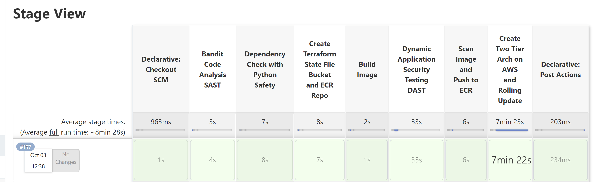
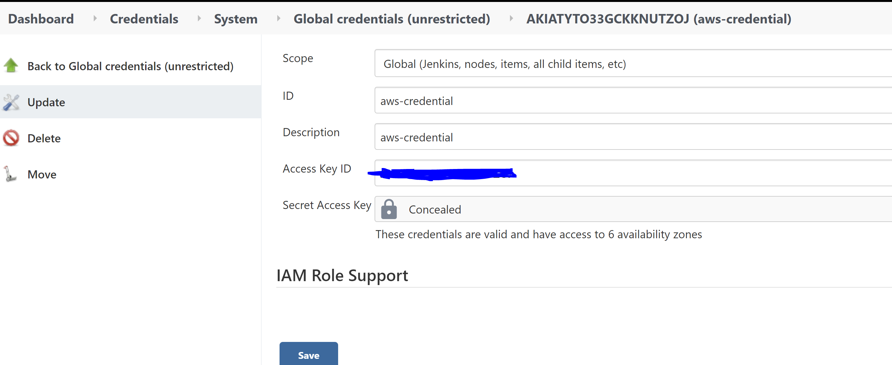
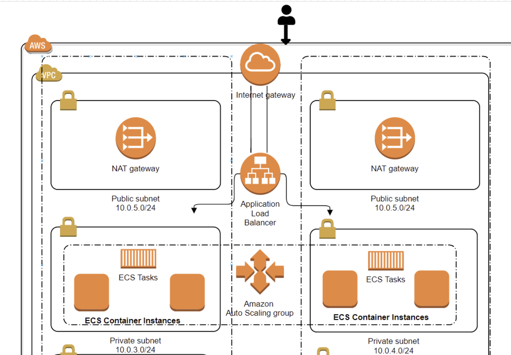
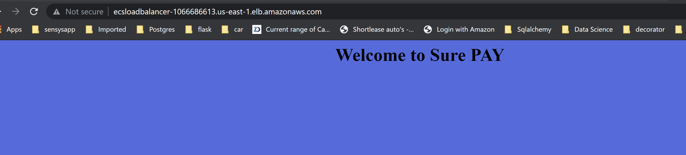

# Web App Deployment on AWS ECS Cluster (Rolling Update Deployment)

This step-by-step tutorial explains how to deploy Python Web App using Jenkins **on AWS ECS Cluster**. I have used **Rolling Update Deployment strategy**.

This setup is very similar to the other setup in which I used an EC2 instance to deploy the Web App and here is the [link](https://github.com/rsthakur83/spay-ec2.git) to it.

**I have tested this setup on AWS region `us-east-1` and also the terraform variable.tf file has values set as per the region `us-east-1` so i recommend to use the same region**.

- [**Web App Deployment on AWS ECS Cluster**](#web-app-deployment-on-aws-ecs-cluster)
  - [**Jenkins Pipeline**](#jenkins-pipeline)
  - [**Prerequisites**](#prerequisites)
  - [**Jenkins Pipeline Stages**](#jenkins-pipeline-stages)
    - [**SAST**](#sast)
    - [**Dependency Check Vulnerability**](#dependency-check-vulnerability)
    - [**Create Terraform State Bucket and ECR Repo**](#create-terraform-state-bucket-and-ecr-repo)
    - [**Build Image**](#build-image)
    - [**Dynamic Application Security Testing**](#dynamic-application-security-testing)
    - [**Scan Image and Push to ECR**](#scan-image-and-push-to-ecr)
    - [**Create Two Tier Architecture and Rolling Update Deployment**](#create-two-tier-architecture-and-rolling-update-deployment)


- [**Web App Two Tier Architecture on AWS ECS Cluster**](#web-app-two-tier-architecture-on-aws-ecs-cluster)

    Let’s go through each of the tiers:
    - [**Tier 1: Public access - Application Load balancer**](#tier-1-public-access---application-load-balancer)
    - [**Tier 2: Restricted access - ECS Containers Running in private subnet**](#tier-2-restricted-access---ecs-containers-running-in-private-subnet)
    
- [**Access Web Application**](#access-web-application)

## **Jenkins Pipeline**

This section explains the prerequisite for setting up ci/cd pipeline using jenkins for Web App running on AWS ECS Cluster.

## **Jenkins Pipeline Stages**



## **Prerequisites**

- First, create a new repository on your github account and clone this repo

- I have used debian 10 OS to install Jenkins, you can use any OS but make sure packages mentioned in the next section are installed on it and after jenkins install add below plugins:

        - Pipeline: AWS Steps
        - Pipeline
        - AWS Secrets Manager Credentials Provider
        - Credentials Plugin
        - Credentials Binding Plugin 
- Install python **bandit**, **trivy** and **owasp zap**

- Secondly, make the following changes in the **Jenkinsfile** of this repo as per your requirement and environment:
  
      - ecr_app = "ecr-app"                                                // ecr repo name to store image
      - terraform_state_bucket = "terraform-state-file-storage-surepay"    // S3 bucket to store terraform state file
      - AWS_ACCOUNT_ID = "259004291460"                                    // AWS Account ID
      - Set aws-credential in Jenkins as shown below diagram
      
      

## **SAST**

This is the first stage of the Jenkins pipeline and in this stage python application code will be scanned **(SAST)** to find OWASP Top 10 vulnerabilities

## **Dependency Check Vulnerability**

This stage checks installed dependencies for known vulnerabilities

## **Create Terraform State Bucket and ECR Repo**

After passing both SAST and vulnerability scan, it creates bucket to store terraform state file and ECR image repo

## **Build Image**

In the build stage it creates the docker images and tagged it based on **aws** **account**, **aws region**, **ECS ECR name** **&** **last tag on the repo** (at the moment this repo has latest tag 6). To check the last tag run below command after cloning this repo.

```
git tag --sort=-creatordate | head -n 1
```

## **Dynamic Application Security Testing**

This stage uses OWASP ZAP to performs dynamic application security testing (DAST) tool to find vulnerabilities in python web applications

## **Scan Image and Push to ECR**

In the 7th stage it scan the docker image for the vulnerability using **trivy** and push it to ECR repo on AWS.

## **Create Two Tier Architecture and Rolling Update Deployment**

In the last stage of pipeline it creates two tier architect on AWS which is mentioned below in detail and performs **rolling update deployment** whenever there is commit in the git repo.

## **Web App Two Tier Architecture on AWS ECS Cluster**



## **Tier 1: Public access - Application Load balancer**

Tier1 is publicly accessible and it has two subnets(ip address range 10.0.5.0/24 & 10.0.6.0/24) spread across two availability zone (us-east-1a, us-east-1b). Application load balancer (ALB) gets deployed in a public subnet so that end user can access application from internet. To achieve high availability for the application two NAT gateway will also be get deployed in each of these public subnets. Application load balancer listens on a port 80 and forwards the traffic to the backend containers running on ec2 instances in tier2 at port 5000. Application load balancer target group configured to perform a health check of backend at port 5000 on the path /.

## **Tier 2: Restricted access - ECS Containers Running in private subnet**

Tier2 also consists of two private subnets (IP address range 10.0.3.0/24 & 10.0.4.0/24) with a NAT gateway attached to the routes associated with these subnets so that instances running in the private subnet can reach the internet. Application instances running in the private subnets are managed/launched under the autoscaling group. Cloudwatch monitoring enabled and configured for scale Out & scale In of the instance and containers based on CPU metrics. These instances registered themselves under the target group which is attached to the ALB. Application security group ingress rule on the private subnet allows only traffic from the load balancer security group at port 5000.

## **Access Web Application**

To access the web application go to the load balancer section on the EC2 of AWS console and enter the dns name of load balancer (http://ecsloadbalancer-1066686613.us-east-1.elb.amazonaws.com/) in your browser and you will see something like below.

